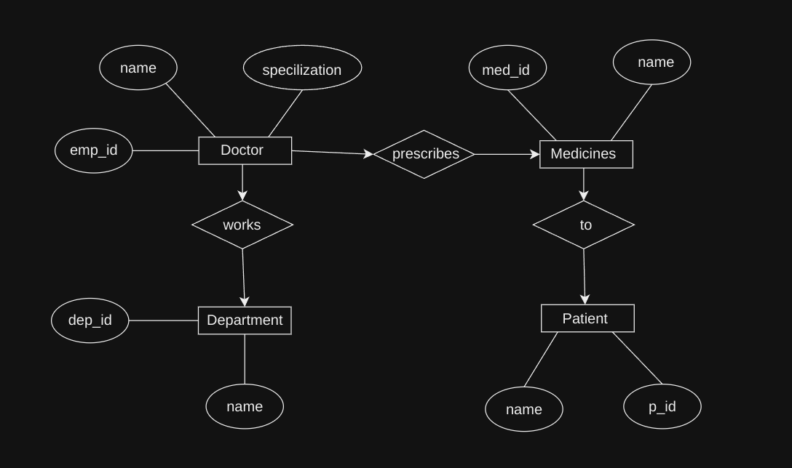

# Hospital Management System Database

## ER Diagram

## Tables

### Department Table

| Field  | Type         | Description                                     |
|--------|--------------|-------------------------------------------------|
| dep_id | INT          | Primary Key, Unique identifier for the department |
| name   | VARCHAR(25)  | Name of the department                          |

### Doctor Table

| Field      | Type         | Description                                     |
|------------|--------------|-------------------------------------------------|
| emp_id     | INT          | Primary Key, Unique identifier for the doctor   |
| name       | VARCHAR(50)  | Name of the doctor                              |
| specialization  | VARCHAR(18)  | Specialization of the doctor                    |
| dep_id     | INT          | Foreign Key referencing Department|

### Medicines Table

| Field  | Type         | Description                                     |
|--------|--------------|-------------------------------------------------|
| med_id | INT          | Unique identifier for the medicine              |
| name   | VARCHAR(50)  | Name of the medicine                            |

### Patient Table

| Field  | Type         | Description                                     |
|--------|--------------|-------------------------------------------------|
| p_id   | INT          | Primary Key, Unique identifier for the patient  |
| name   | VARCHAR(50)  | Name of the patient                             |
| med_id | INT          | Foreign Key referencing Medicines  |
| emp_id | INT          | Foreign Key referencing Doctor  |

